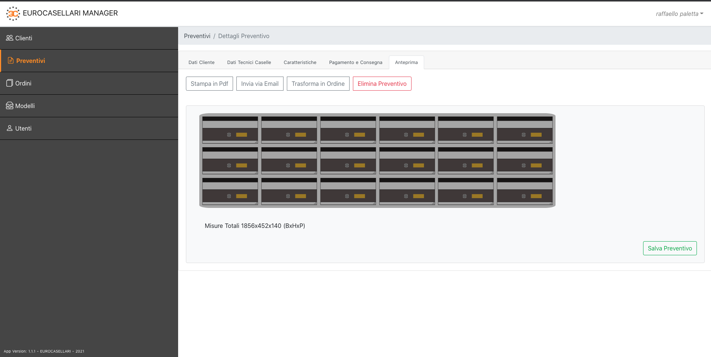
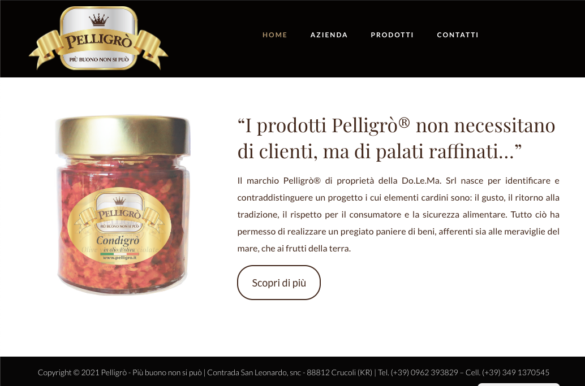

# Projects & Experience

## Oct 2017 - Present

### Xconik - Milan Area, IT (Remote)

**Project**: Xconik - from vending machines to instant e-commerce

- scope: E-Commerce, IoT
- site: [https://www.xconik.com](https://www.xconik.com)

**Role**: Head of Project, Lead Software Architect, Backend Developer 

Software Architect and Developer using state-of-the-art technologies and methodologies (e.g. Microservices Architecture, Domain-Driven Design, Continuous Integration\Deployment, Serverless Architecture, Faas, Docker, api gateway) modern frameworks and stacks (e.g. Symfony2-5, Express.js, ELK, Datadog) development best practices (e.g design patterns) and collaboration tools to increase productivity (e.g. Slack, github, wrike, circleci).
I also deal with devops tasks, such as configuring orchestrations tools (nomad, kubernetes) that runs on cloud (aws, digitalocean).

---
**Tech Resume** 

 
 
 
 
 
 
 
 
 
 
 
 
 
 
 
 
 
 
 
 
 
 

---

## Apr 2009 - Oct 2017

### Alter.Net - Rome Area, IT

**Project**: NE.MO. - Network Monitor and more

- scope: Monitoring, Ticketing and Reporting Solution
- site: [https://www.alternet.it/armonic/](https://www.alternet.it/armonic/)

**Role**: Senior Full Stack Developer

---

**Project**: ELM - Embedded Local Mirrors

- scope: Content Distribution, Scalability
- site: [https://www.alternet.it/elm/](https://www.alternet.it/elm/)

**Role**: Senior Full Stack Developer

---

**Project**: REALMS - Authorization Authentication Accounting

- scope: AAA, Network Access Control, User Access Policy 
- site: [https://www.alternet.it/realms/](https://www.alternet.it/realms/)

**Role**: Middle Full Stack Developer 

---

**Project**: Others related to various customers

- scope: Document Archive, Showcase websites, Management Software, etc 

**Role**: Junior Full Stack Developer 

---

**Tech Resume**

 

 

 

---

## Feb 2007 - Apr 2009

### 3boox Srl - Avellino Area, IT

**Project**: 3boox - Social Network Platform Startup

- scope: Social Network, Media Company, Content Marketing

**Role**: Junior Full Stack Developer, Soft Computing Consultant

---

**Tech Resume**

 

 

---

# Latest Free Time Jobs

### Management software for mailbox vendors

 

---

### Web Site

---

# Other

* [NLP: Un approccio fuzzy nella classificazione di documenti testuali (TC)](https://raffaellopaletta.medium.com/nlp-un-approccio-fuzzy-nella-classificazione-di-documenti-testuali-tc-db80cf3d3879)
* [TDD nodejs — How to test if a pdf file is as expected using mocha, chai and supertest.](https://raffaellopaletta.medium.com/tdd-nodejs-how-to-test-if-a-pdf-file-is-as-expected-using-mocha-chai-and-supertest-7df6129c9486)
